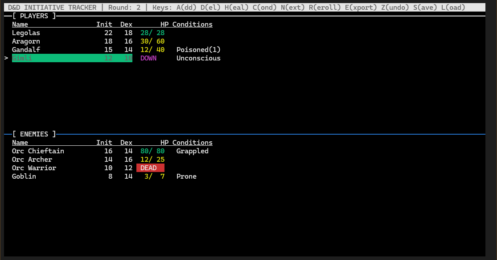

# D&D Initiative Tracker

A terminal-based initiative tracker for Dungeons & Dragons 5th Edition combat encounters, built with C and ncurses.



## Features

- **Combatant Management**: Add, remove, and manage players and enemies
- **Initiative Tracking**: Automatic sorting by initiative and dexterity
- **HP Tracking**: Visual HP indicators with color coding (Good/Hurt/Critical/Unconscious/Dead)
- **Death Saving Throws**: Full 5e death save implementation with automatic rolling at start of turn
- **Interactive Condition Menu**: Overlay menu for easy condition management with navigation
- **Condition Management**: Apply and track 15 different conditions with optional durations
- **Turn Management**: Navigate through combat rounds with next/previous turn controls
- **Combat Logging**: Automatic logging of combat actions with export functionality
- **Message Queue**: Non-blocking message system for multiple notifications
- **Help Menu**: Built-in help screen accessible with `?` key
- **Undo System**: Undo last action (up to 10 states)
- **Save/Load**: Persist game state between sessions
- **Color-Coded UI**: Visual distinction between players and enemies

## Requirements

- GCC compiler
- ncurses library

### Installing ncurses

**Linux (Debian/Ubuntu):**
```bash
sudo apt-get install libncurses5-dev libncursesw5-dev
```

**Linux (Fedora/RHEL):**
```bash
sudo dnf install ncurses-devel
```

**macOS:**
```bash
brew install ncurses
```

**Windows (WSL):**
```bash
sudo apt-get install libncurses5-dev libncursesw5-dev
```

## Compilation

Using Makefile (recommended):
```bash
make
```

Or manually:
```bash
gcc -Wall -Wextra -Wshadow -Wconversion -Wpedantic -Werror -std=c11 initiative.c -lncurses -o initiative
```

Or with standard warnings:
```bash
gcc initiative.c -lncurses -o initiative
```

### Makefile Targets

- `make` or `make all` - Build the executable
- `make clean` - Remove compiled binaries
- `make install` - Install to `/usr/local/bin` (optional)
- `make uninstall` - Remove from `/usr/local/bin`

## Usage

```bash
./initiative
```

### Controls

- **A** - Add combatant
- **D** - Delete selected combatant
- **H** - Edit HP (heal/damage)
- **C** - Toggle conditions (opens interactive menu)
- **N** - Next turn
- **P** - Previous turn
- **R** - Reroll initiative
- **X** - Roll death save (manual, for selected combatant)
- **T** - Stabilize combatant (Spare the Dying/Medicine/Healer's Kit)
- **E** - Export combat log
- **Z** - Undo last action
- **S** - Save game state
- **L** - Load game state
- **↑/↓** or **k/j** - Navigate selection
- **?** - Show help menu
- **Q** - Quit

## Game Rules

- **Players**: Go unconscious at 0 HP (not dead)
- **Enemies**: Die at 0 HP
- **Initiative**: Sorted by initiative roll, then dexterity modifier
- **Conditions**: Can be applied with optional durations (in rounds)

### Death Saving Throws (5e Rules)

When a player character drops to 0 HP, they begin making death saving throws:

- **Automatic**: Death saves are rolled automatically at the start of each turn when at 0 HP
- **Roll Results**:
  - **Natural 20**: Regain 1 HP immediately
  - **Natural 1**: Two failures
  - **10-19**: Success (toward 3 successes = stable)
  - **2-9**: Failure (toward 3 failures = death)
- **3 Successes**: Become stable (still at 0 HP, unconscious, but no longer making saves)
- **3 Failures**: Die
- **Damage at 0 HP**: Regular damage = 1 failure, Critical hit = 2 failures
- **Instant Death**: If damage reduces you to 0 HP and remaining damage ≥ max HP, instant death (no saves)
- **Stabilization**: Use **T** key to stabilize (simulates Spare the Dying, Medicine check, or Healer's Kit)
- **Healing**: Any healing resets death saves and removes unconscious condition

### Interactive Condition Menu

Press **C** while a combatant is selected to open an interactive overlay menu:
- Navigate with **UP/DOWN** or **k/j** keys
- Toggle conditions with **ENTER** or **SPACE**
- Set duration with **d** key (for active conditions)
- Close with **ESC** or **q**
- Shows all 15 conditions with visual indicators for active ones

## File Locations

- **Save file**: `~/.dnd_tracker_save.txt` (or current directory if `HOME` is not set)
- **Log export**: `~/combat_log_export.txt` (or current directory if `HOME` is not set)

## License

This project is licensed under the MIT License - see the [LICENSE](LICENSE) file for details.